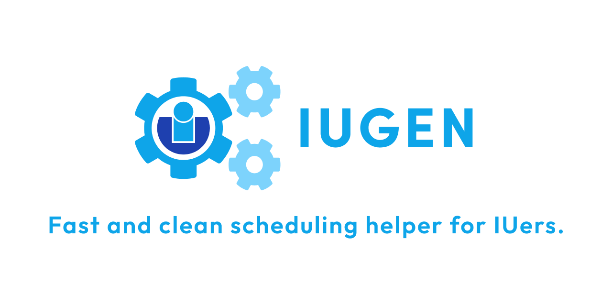
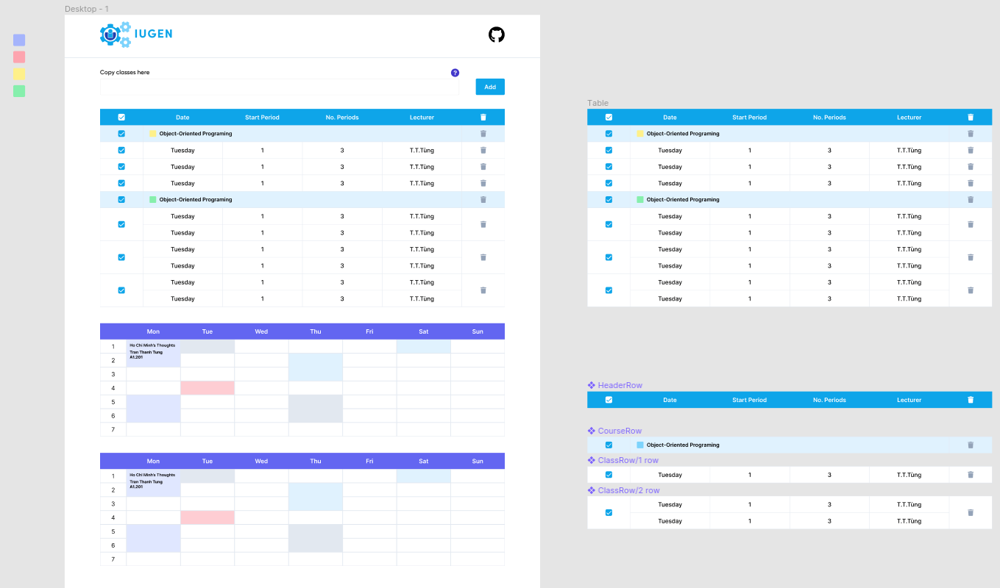
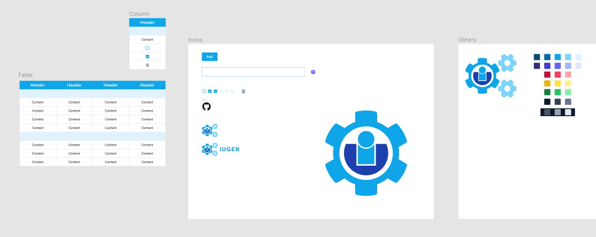
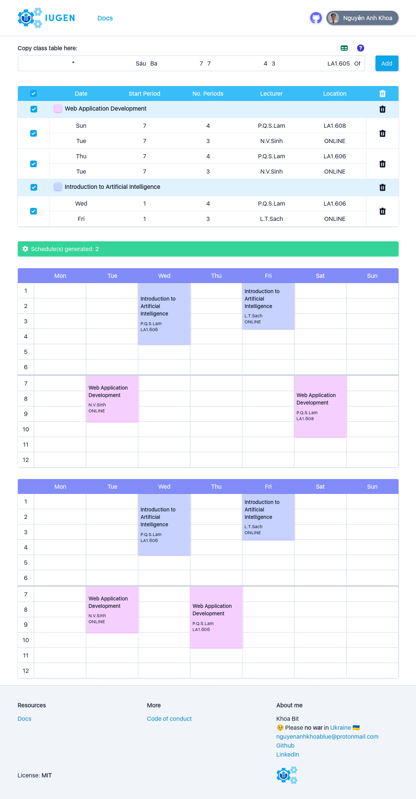

<p align="center">
    
</p>

---

## Goals

Every semester students of [HCMC International University](https://hcmiu.edu.vn/) (AKA IUers)
have to register a lot of classes which leads to conflicting timelines.
It is well-known that the current scheduling process is very time-consuming and prone to errors.
Moreover, It is hard to come up with every possible schedules, so we would miss potential
schedule that fits us perfectly.

So, IUGen was built to be a fast and clean schedule generator for IUers.

## My Journey

The [first version of IUGen](https://github.com/Khoa-bit/IUGen) was built on
01/08/2021 as Python Script. Because It served me so well, I wanted to share and build
a more user-friendly interface of IUGen.

**So my goal with IUGen 2 was:**

- A fast and user-friendly web app.
- An opportunity to learn about Javascript and Typescript.
- To use a modern tech stack: ReactJS and TailwindCSS for Front end, NextJS for Back end.
- To learn about UI/UX design fundamentals.
- To learn about vector graphic basics.

**Here are some IUGen designs in Figma:**

<p align="center">
    
    <br/>IUGen in Figma design
</p>
<p align="center">
    
    <br/>IUGen Components in Figma design
</p>

**Here is IUGen web app:**

<p align="center">
    
    <br/>IUGen in Production early 2022
</p>

## Run it yourself

First, clone IUGen2 Github repository locally.

Second, run the development server:

```bash
npm run dev
```

Open [http://localhost:3000](http://localhost:3000) with your browser to see the result. Done! :3
